# PassKeeper

Offline password manager for Windows. No network access, no cloud, no telemetry. Per-user installation without administrator rights or machine-wide installation for all users.

[English](#english) · [Русский](#русский) · User guide: [EN](docs/manual.en.md), [RU](docs/manual.ru.md)

---

## English

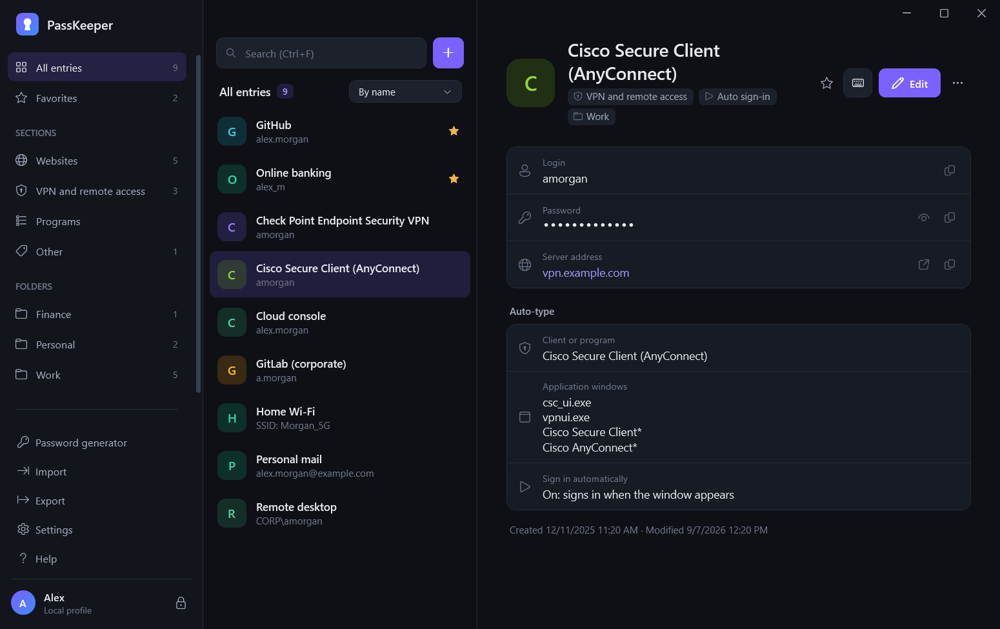

| | | |
|---|---|---|
| 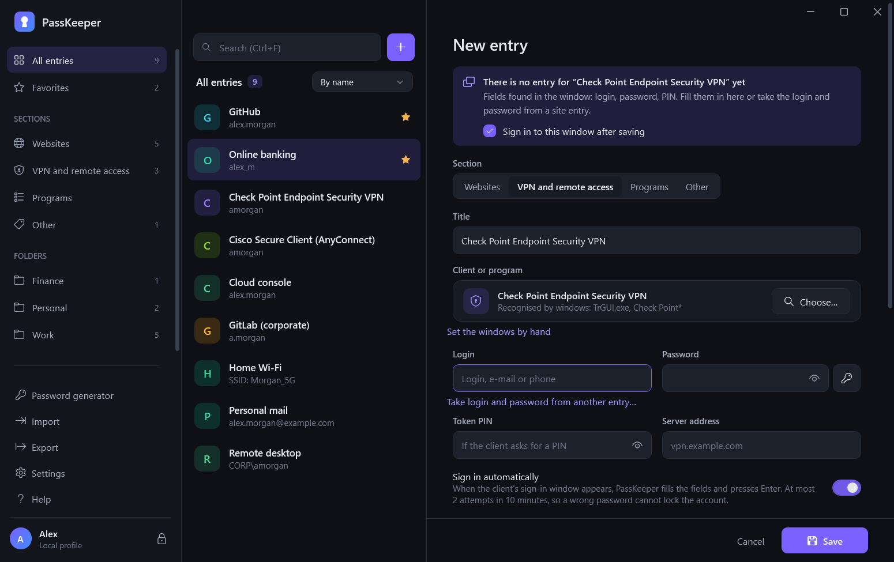 | 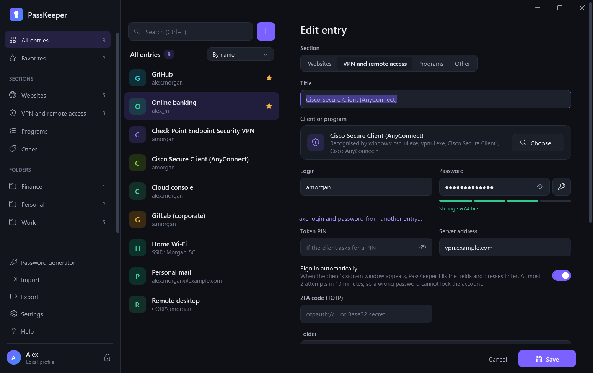 | 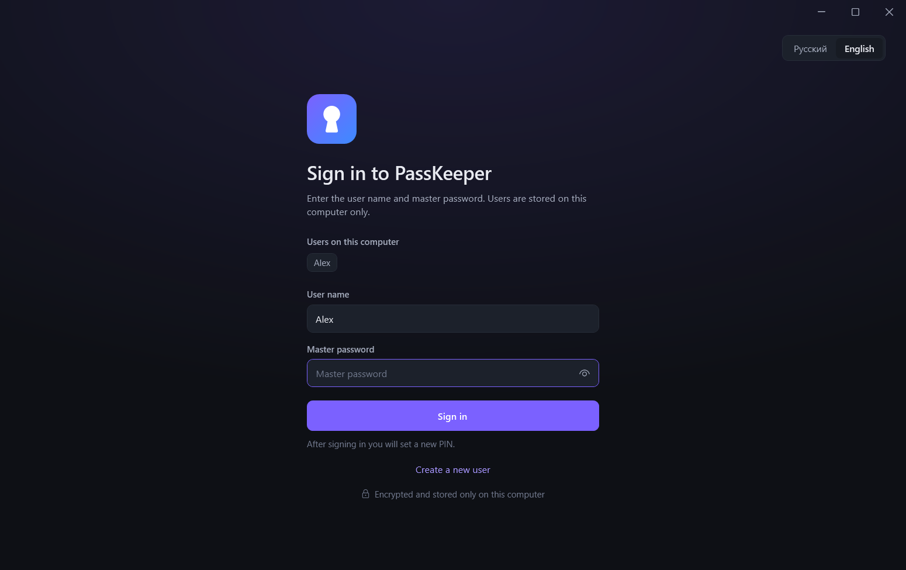 |
| 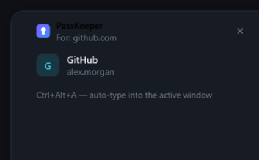 | 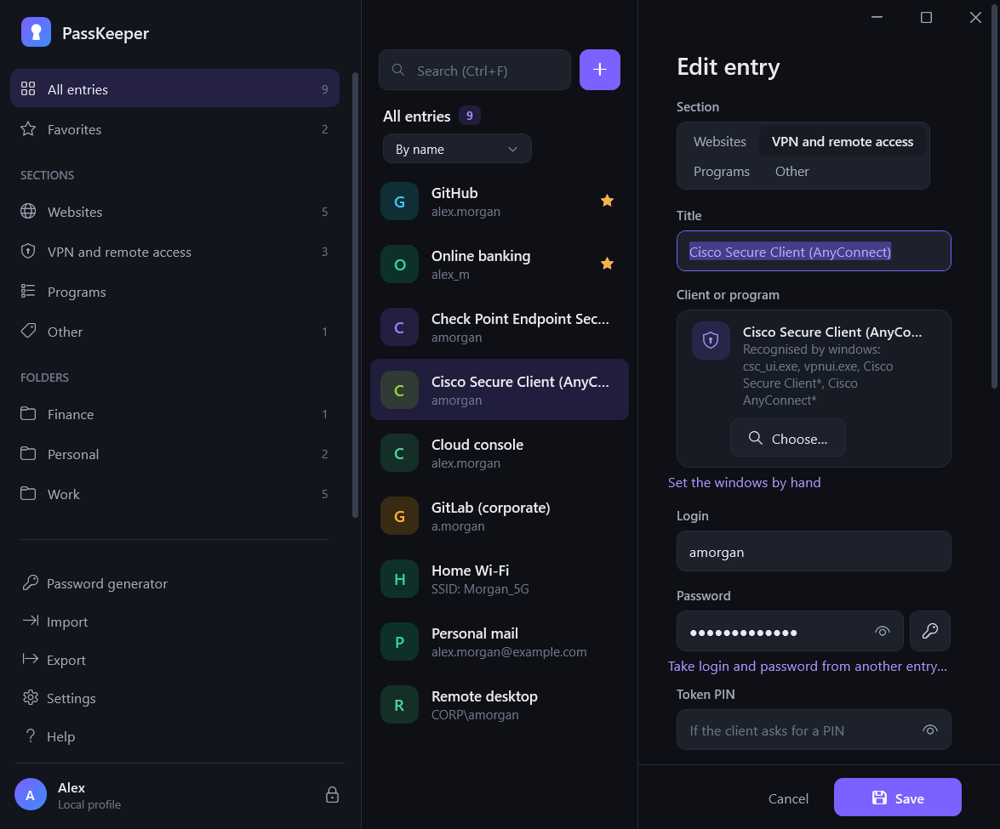 | 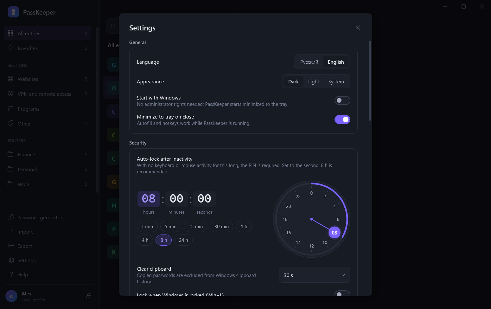 |
| 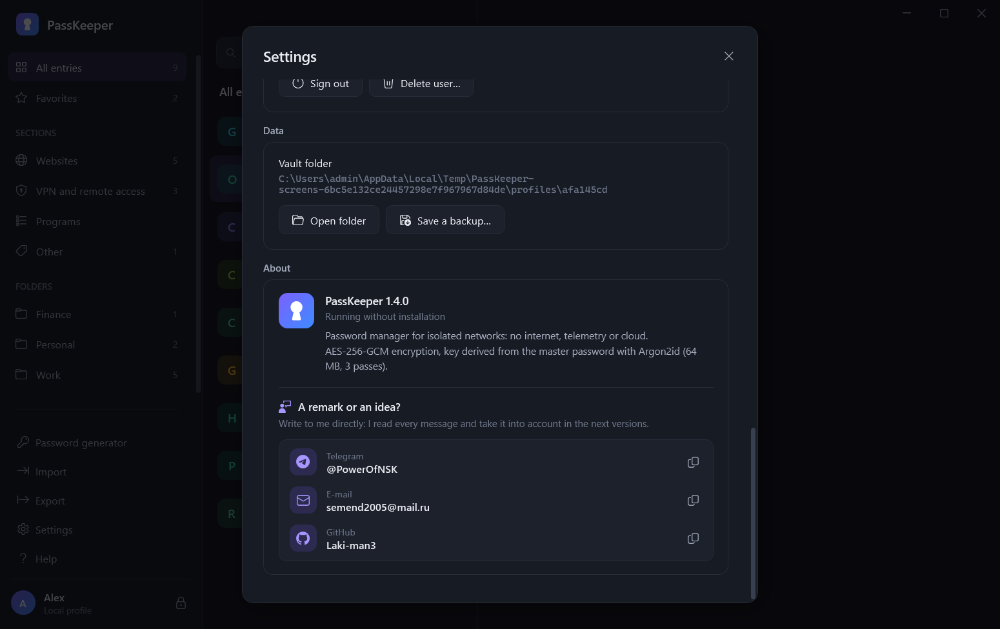 | 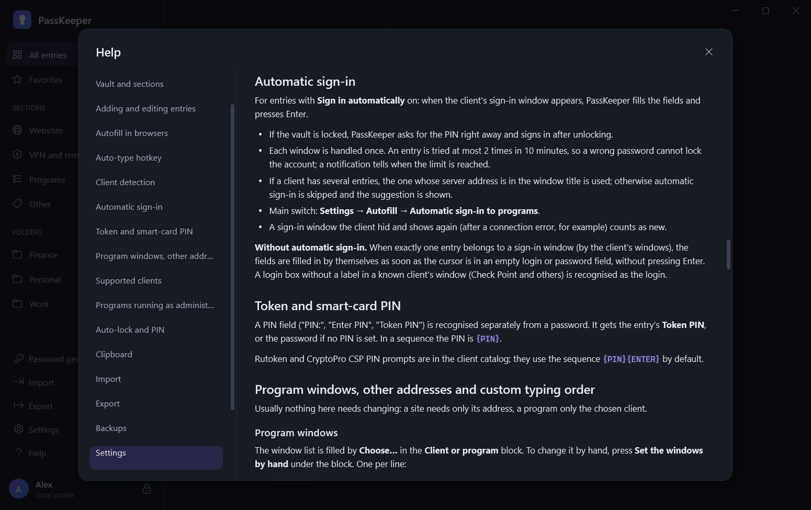 | 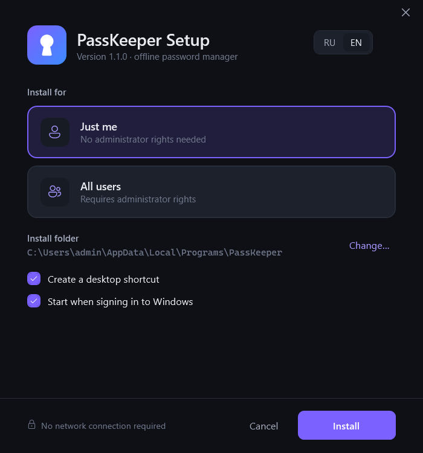 |

### Specifications

| Parameter | Value |
|---|---|
| OS | Windows 10 (1903+), Windows 11, x64 |
| Runtime | self-contained .NET 10; installer and uninstaller run on the built-in .NET Framework 4.8 |
| Network | none |
| Package size | installer 67 MB, installed 161 MB |
| Resource use | in the tray: ~15 MB working set, no CPU load while idle (no timers or animations while hidden) |
| Users | several local users, each with its own vault, PIN and backups; sign out / sign in by name and master password |
| Vault encryption | AES-256-GCM, random 256-bit vault key |
| Key derivation | Argon2id, 64 MiB, 3 iterations, 4 lanes, 256-bit salt |
| Integrity | file header authenticated as AAD; any modification is detected |
| Quick unlock | PIN 4–12 digits, Argon2id + Windows DPAPI binding, 5 attempts, then master password |
| Auto-lock | after 8 h of inactivity by default; any period from 10 s to 24 h, set to the second on a dial; optionally on Windows lock |
| Clipboard | cleared after 30 s (10–60 s / never), excluded from clipboard history and cloud sync |
| Backups | previous version + daily copies for 14 days (encrypted) |
| Autofill | UI Automation / MSAA field detection, SendInput typing; a sign-in page is found and filled when it opens, also without the cursor in the form (verified in Chrome 154, Firefox 156, Yandex Browser 26.8); desktop sign-in clients: VPN, VDI, RDP, token PIN prompts |
| Automatic sign-in | when a client's sign-in window appears; at most 2 attempts per entry in 10 minutes |
| Auto-type hotkey | Ctrl+Alt+A (configurable) |
| Import | 25+ sources, see below |
| Export | 13 formats |
| UI languages | English, Russian |
| Help | built-in user guide (works offline) |
| Tests | 105 unit tests |

### Features

- Sections: Websites, VPN and remote access, Programs, Other. The editor shows the fields of the section; entries of older versions get their section automatically.
- Entry fields: title, login, password, URLs, e-mail, phone, key/token, token PIN, TOTP, notes, folders, favorites, custom (hidden) fields, password history, trash.
- Duplicate an entry, or copy a site's login and password into an entry for a VPN client or program. When a password changes, entries that still use the old one can be updated at once.
- Users: first run creates a local user (name + master password), then a mandatory PIN; later starts and inactivity locks ask for the PIN only. Sign out deletes the PIN; signing in again takes the name and master password and a new PIN. Deleting a user in Settings erases that user's vault, PIN and backups. Data of earlier versions becomes the first user.
- Websites: when a sign-in page opens, its form is found (the cursor is put into the login field with a click if needed, only when nothing covers it) and filled with the entry saved for that address, even when other entries share the domain (a company's other services). Several candidates: a list next to the login field; the chosen entry becomes the account for that site and is filled in by itself next time, also among several accounts saved for one address. A site is its host name, so sign-in pages with a fresh one-time link every time are recognised; a page is also noticed by its changed address when the title stays the same. No entry: pick any entry and remember the site for it. Each page is filled once and a site at most twice in 3 minutes; fields the user has typed in are left alone. An optional autofill log (no logins, passwords or full addresses) shows why a form was or was not filled.
- Entries work both ways: a site's login and password can be copied into an entry for a VPN client or program, and any VPN or program entry can be used on a website ("Use for a website…").
- Autofill in applications: a suggestion appears next to a focused login, password, e-mail, phone, one-time code, PIN or key field; when one entry belongs to the window, an empty form is filled in by itself (without Enter). The auto-type hotkey matches the active site or window and fills its fields one by one.
- Resizable layout: the borders between sections, the entry list and the details can be dragged; widths are remembered. In a small window the panes narrow and fields and buttons are placed one under another.
- Dialogs (settings, help, generator) close with Esc or a click next to them.
- Password generator with a strength estimate; overview of reused passwords.
- Tray, autostart (no administrator rights), dark/light/system theme.

### Desktop sign-in clients

No manual window setup is needed:

- **Detection.** Ctrl+Alt+A in the window of a client without an entry opens a new entry with the client, its windows and its form fields already recognised; the login and password can be taken from a site entry. After saving, PassKeeper signs in to that window.
- **Client list.** "Choose…" in the editor finds running and installed clients (uninstall registry, running processes) and lists any other open window.
- **Automatic sign-in.** For entries with "Sign in automatically", the fields are filled and Enter is pressed when the sign-in window appears; a locked vault asks for the PIN first. Each window is handled once, at most 2 attempts per entry in 10 minutes. Several accounts of one client are told apart by the server address in the window title.
- Fields are filled one by one: a remembered login is kept or replaced, a password, PIN or code field gets only its value; a text box without a label in a known client's window is taken as the login.
- Token / smart-card PIN: the entry's "Token PIN" field (otherwise the password); `{PIN}` in sequences.
- Clients running as administrator or SYSTEM: Windows blocks simulated input (UIPI); the password or PIN goes to the clipboard (cleared as configured) with a notification.
- Custom typing order (terminals, custom-drawn windows), folded at the bottom of the editor: placeholders are inserted by clicking, with ready-made examples. The client's window list is set by "Choose…" and can be edited by hand.

| Group | Clients |
|---|---|
| VPN | Cisco Secure Client (AnyConnect), Check Point Endpoint Security VPN, FortiClient, Palo Alto GlobalProtect, OpenVPN GUI / Connect, Континент-АП, ViPNet Client |
| VDI / remote desktop | Базис.WorkPlace (ВРМ), Citrix Workspace, Omnissa / VMware Horizon, Termidesk, Remote Desktop / Windows Security |
| Tokens | Рутокен and КриптоПро CSP PIN prompts |
| Other | 1С:Предприятие, SAP GUI, PuTTY / KiTTY, WinSCP, any open window |

### Import / export

| Import | |
|---|---|
| Browsers (direct) | Chrome, Edge, Yandex Browser, Opera, Opera GX, Brave, Vivaldi, Chromium, Atom, Firefox, Waterfox, LibreWolf, Floorp, Zen, Thunderbird |
| Password managers | KeePass/KeePassXC (KDBX 3.1/4 with password and key file, XML, CSV), Bitwarden (JSON, CSV), 1Password (1PUX, CSV), LastPass, Dashlane, NordPass, Proton Pass, RoboForm, Keeper, Kaspersky Password Manager |
| Other | Windows Credential Manager, any CSV (UTF-8/UTF-16/Windows-1251, `,` `;` Tab), PassKeeper PKX/JSON |

Export: PassKeeper PKX (encrypted), KeePass KDBX 4 (encrypted), CSV for Chromium browsers, Firefox, Bitwarden, 1Password, LastPass, KeePassXC, full CSV, full JSON, Bitwarden JSON, KeePass XML, HTML. Every export requires the master password.

Chrome 127+ protects newly saved passwords with App-Bound Encryption, which third-party applications cannot read. Such entries are listed in the import report; export them from Chrome (Settings → Password Manager → Export) and import the CSV.

### Installation

```bat
PassKeeper-Setup-1.4.1.exe
```

| Mode | Location | Rights |
|---|---|---|
| Just me | `%LOCALAPPDATA%\Programs\PassKeeper` | user |
| All users | `%ProgramFiles%\PassKeeper` | administrator |
| Portable (zip) | any folder, data in `.\Data` | user |

The autostart and language chosen in the installer are used on the first run.

Silent install: `/S`, `/allusers` or `/currentuser`, `/desktop`, `/autostart` or `/noautostart`, `/nolaunch`, `"/dir=path"`, `/lang=en|ru`. Exit codes: 0 ok, 1 error, 740 elevation required, 1602 cancelled.

```bat
PassKeeper-Setup-1.4.1.exe /S /allusers /desktop /autostart
```

### Uninstall

`Uninstall.exe` in the installation folder, Start menu → PassKeeper → Uninstall PassKeeper, Settings → Apps, or PassKeeper → Settings → About. PassKeeper copies running from the installation folder are closed first; program files, shortcuts, autostart (including its Task Manager entry) and registry entries are removed; the user's data in `%APPDATA%\PassKeeper` is removed only when **Also remove my data** is checked.

Silent: `Uninstall.exe /S` (data kept), `Uninstall.exe /S /removedata`.

Data: `%APPDATA%\PassKeeper` — `settings.json`, `profiles\<user>\` with `vault.pkv`, `pin.dat` (DPAPI), `Backups\`. Override with `--data <dir>`; a copy started with its own data folder runs as a separate instance.

### Build

Requires .NET 10 SDK; 7-Zip for the split archive (optional).

```powershell
powershell -ExecutionPolicy Bypass -File .\build.ps1
```

Output in `dist\<version>\`: installer, portable zip, `SHA256SUMS.txt`, `7z\` volumes. Tests: `dotnet test tests/PassKeeper.Tests`.

| Path | Contents |
|---|---|
| `src/PassKeeper.Core` | cryptography, vault, PIN, import/export, KDBX, TOTP, matching, field classification, client catalog |
| `src/PassKeeper` | WPF application |
| `src/PassKeeper.Setup` | installer and uninstaller (.NET Framework 4.8) |
| `tests/PassKeeper.Tests` | unit tests |
| `docs/manual.*.md` | user guide (also embedded as in-app help) |

### Limitations

- Simulated input cannot reach applications running as SYSTEM; applications running as administrator need PassKeeper started as administrator too. In both cases the clipboard fallback is used.
- Sign-in clients were checked against dialogs with the same structure (Cisco and Check Point login forms, token PIN prompt); vendor builds may differ.
- Automatic filling on websites needs fields exposed through the browser's accessibility interface (regular HTML inputs); for other forms use the hotkey.
- Binaries are not code-signed.
- The master password cannot be recovered.

---

## Русский

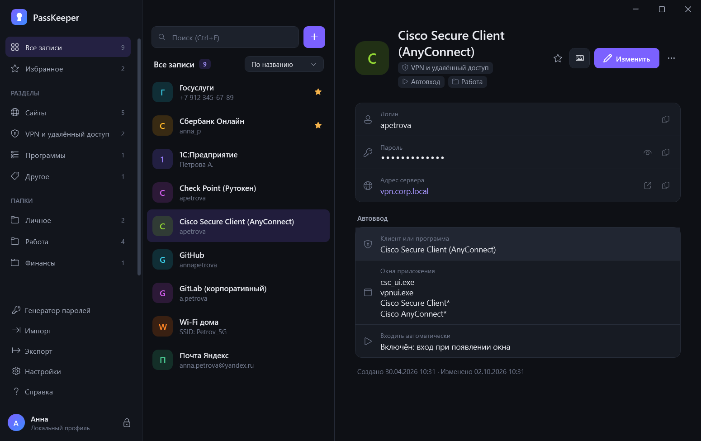

| | | |
|---|---|---|
| 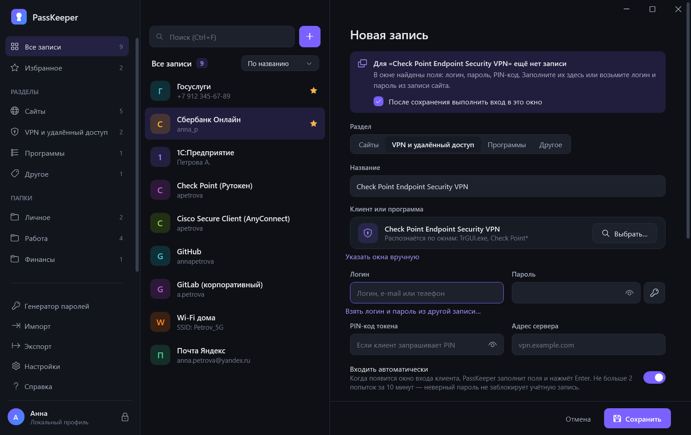 | 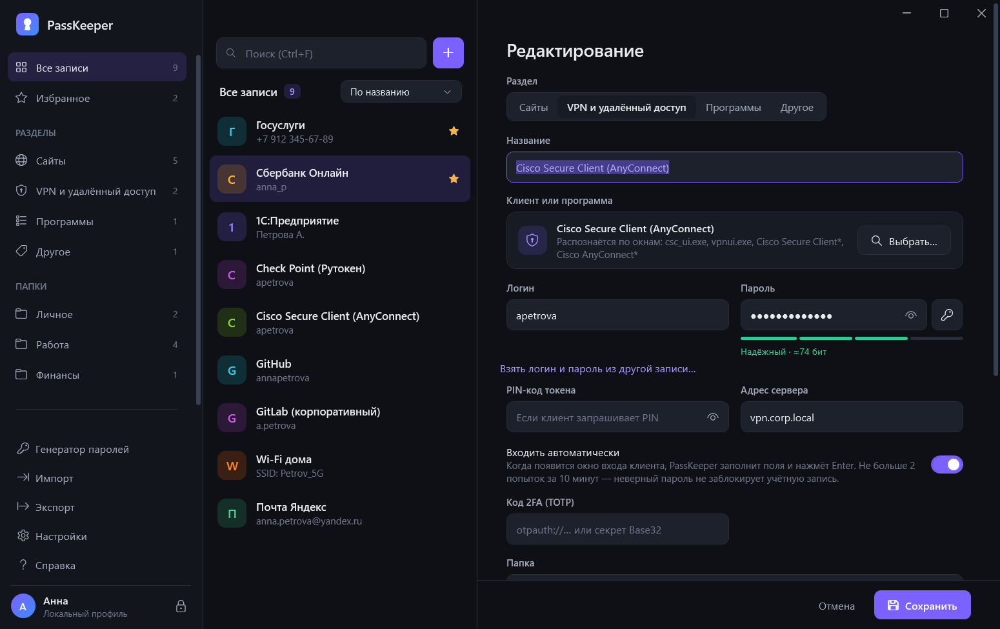 | 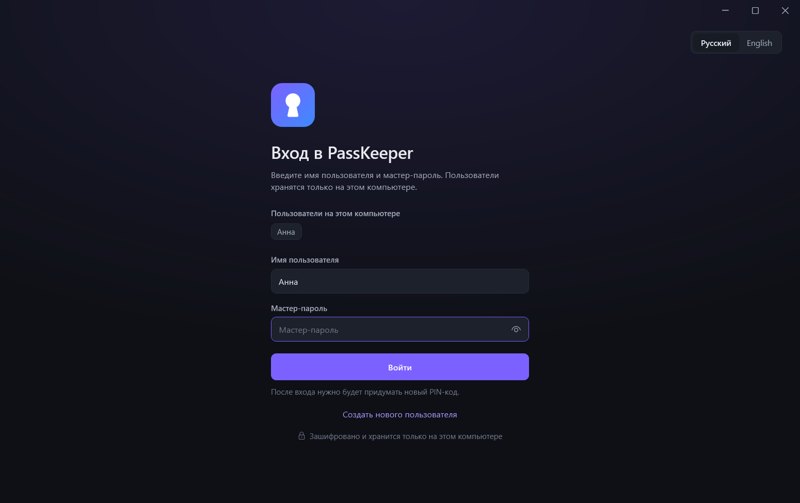 |
| 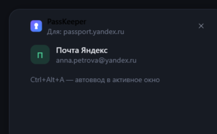 | 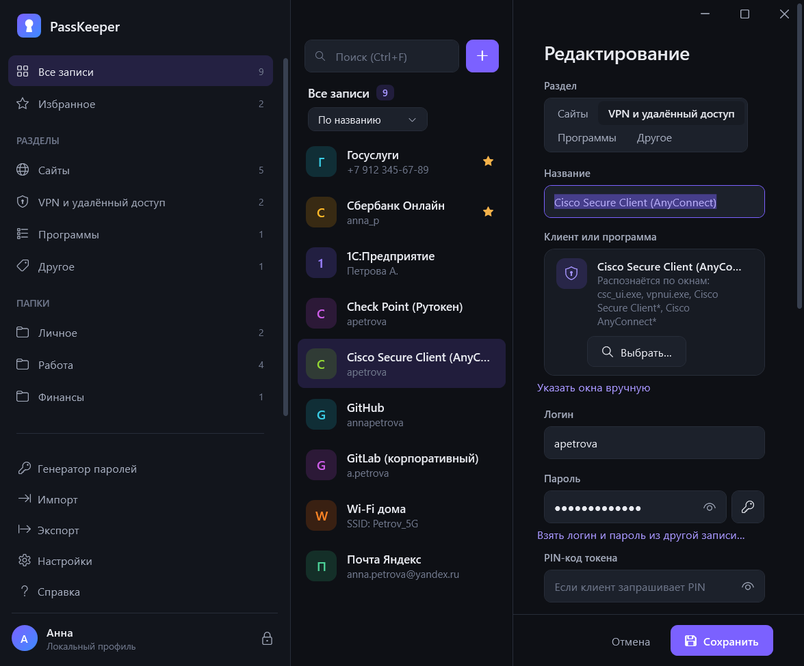 | 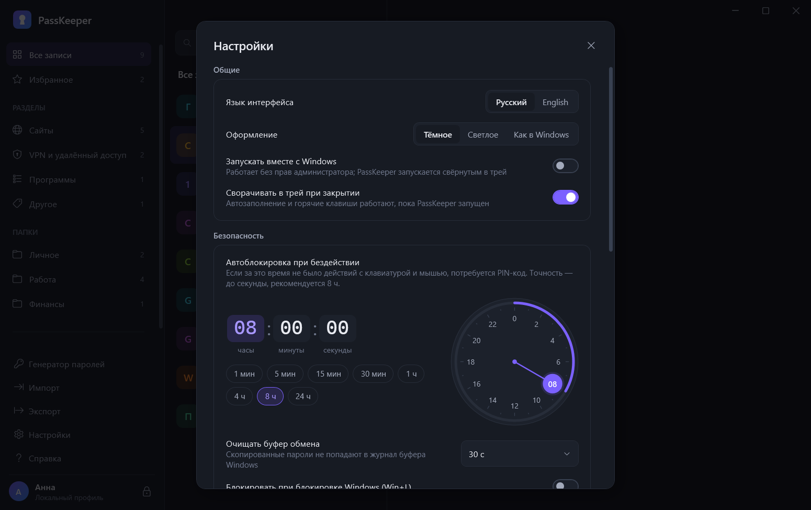 |
| 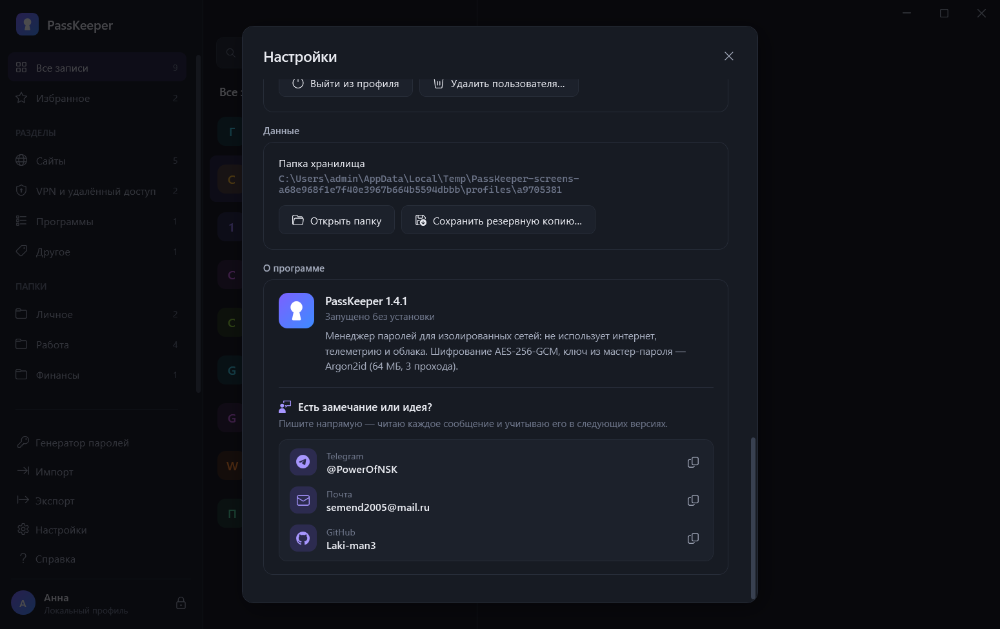 | 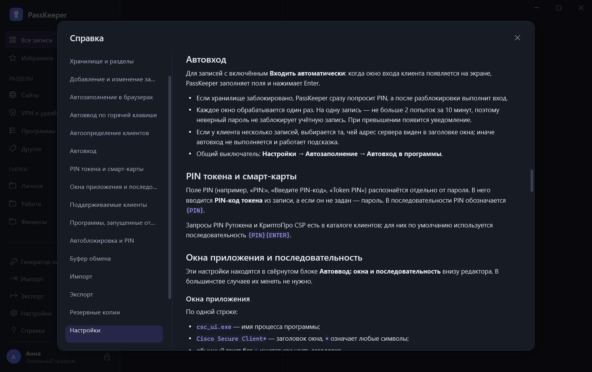 | 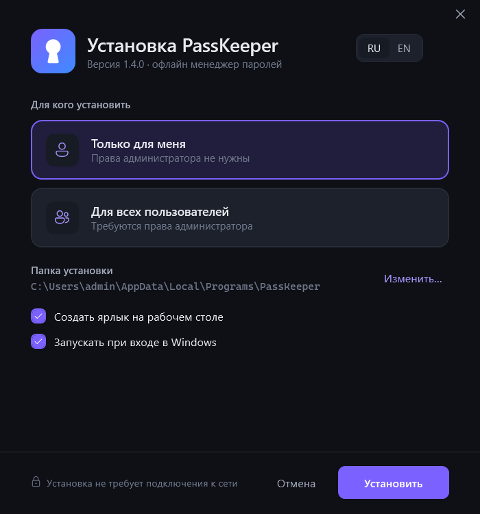 |

### Характеристики

| Параметр | Значение |
|---|---|
| ОС | Windows 10 (1903+), Windows 11, x64 |
| Среда выполнения | встроенная .NET 10; установщик и деинсталлятор работают на штатном .NET Framework 4.8 |
| Сеть | не используется |
| Размер | установщик 67 МБ, после установки 161 МБ |
| Потребление ресурсов | в трее: ~15 МБ рабочего набора, без нагрузки на процессор в простое (скрытое окно не держит таймеров и анимаций) |
| Пользователи | несколько локальных пользователей, у каждого своё хранилище, PIN и резервные копии; выход и вход по имени и мастер-паролю |
| Шифрование хранилища | AES-256-GCM, случайный 256-битный ключ |
| Формирование ключа | Argon2id, 64 МиБ, 3 прохода, 4 потока, соль 256 бит |
| Целостность | заголовок файла аутентифицируется (AAD), любое изменение обнаруживается |
| Быстрый вход | PIN 4–12 цифр, Argon2id + привязка к учётной записи Windows (DPAPI), 5 попыток, затем мастер-пароль |
| Автоблокировка | по умолчанию через 8 ч бездействия; любой срок от 10 с до 24 ч с точностью до секунды на циферблате; опционально при блокировке Windows |
| Буфер обмена | очистка через 30 с (10–60 с / никогда), исключение из журнала и облачной синхронизации |
| Резервные копии | предыдущая версия + ежедневные копии за 14 дней (зашифрованы) |
| Автозаполнение | поиск полей через UI Automation / MSAA, ввод через SendInput; страница входа находится и заполняется при открытии, даже если курсор не в форме (проверено в Chrome 154, Firefox 156, Яндекс Браузере 26.8); клиенты входа: VPN, VDI, RDP, запросы PIN токенов |
| Автовход | при появлении окна входа клиента; не больше 2 попыток на запись за 10 минут |
| Горячая клавиша автоввода | Ctrl+Alt+A (настраивается) |
| Импорт | 25+ источников, см. ниже |
| Экспорт | 13 форматов |
| Языки интерфейса | русский, английский |
| Справка | встроенное руководство (работает без сети) |
| Тесты | 105 модульных тестов |

### Возможности

- Разделы: Сайты, VPN и удалённый доступ, Программы, Другое. Редактор показывает поля выбранного раздела; записям из прежних версий раздел назначается автоматически.
- Поля записи: название, логин, пароль, адреса сайтов, e-mail, телефон, ключ/токен, PIN токена, TOTP, заметки, папки, избранное, дополнительные (скрытые) поля, история паролей, корзина.
- Дублирование записи и копирование логина и пароля сайта в запись для VPN‑клиента или программы. При смене пароля записи со старым паролем можно обновить сразу.
- Пользователи: при первом запуске создаётся локальный пользователь (имя + мастер-пароль), затем обязательный PIN; при следующих запусках и после автоблокировки запрашивается только PIN. Выход из пользователя удаляет PIN; при повторном входе нужны имя и мастер-пароль и новый PIN. Удаление пользователя в настройках стирает его хранилище, PIN и резервные копии. Данные прежних версий становятся первым пользователем.
- Сайты: при открытии страницы входа PassKeeper находит форму (если нужно, ставит курсор в поле логина щелчком — только когда поле ничем не закрыто) и подставляет запись, сохранённую для этого адреса, даже если у домена есть другие записи (другие сервисы компании). Несколько кандидатов — список у поля логина; выбранная запись становится основной для сайта и в следующий раз подставится сама, даже если для одного адреса сохранено несколько учётных записей. Сайт определяется по имени, поэтому страницы входа с новой одноразовой ссылкой при каждом входе распознаются; открытие страницы замечается и по смене адреса, если заголовок не меняется. Записи нет — можно выбрать любую и запомнить для неё сайт. Каждая страница заполняется один раз, сайт — не больше двух раз за 3 минуты; поля, в которые пользователь уже что-то ввёл, не трогаются. Журнал автозаполнения (по желанию, без логинов, паролей и полных адресов) показывает, почему форма заполнена или нет.
- Записи работают в обе стороны: логин и пароль сайта копируются в запись VPN‑клиента или программы, а запись VPN или программы можно использовать на сайте («Использовать для сайта…»).
- Автозаполнение в программах: подсказка появляется рядом с полем логина, пароля, e-mail, телефона, одноразового кода, PIN или ключа; если окну соответствует одна запись, пустая форма заполняется сама (без Enter). Горячая клавиша подбирает запись по сайту или окну и заполняет поля по отдельности.
- Размеры панелей: границы между разделами, списком записей и карточкой перетаскиваются мышью; ширина запоминается. В небольшом окне панели сужаются, а поля и кнопки перестраиваются в столбик.
- Диалоги (настройки, справка, генератор) закрываются по Esc или щелчку рядом с окном.
- Генератор паролей с оценкой стойкости; обзор повторяющихся паролей.
- Трей, автозапуск (без прав администратора), тёмная/светлая/системная тема.

### Клиенты входа (VPN, VDI, RDP)

Добавлять окна вручную не нужно:

- **Автоопределение.** Ctrl+Alt+A в окне клиента, для которого нет записи, открывает новую запись с уже определёнными клиентом, окнами и полями формы; логин и пароль можно взять из записи сайта. После сохранения PassKeeper выполняет вход в это окно.
- **Список клиентов.** Кнопка «Выбрать…» в редакторе находит запущенные и установленные клиенты (по реестру программ и процессам) и показывает любые другие открытые окна.
- **Автовход.** Для записей с включённым «Входить автоматически» при появлении окна входа поля заполняются и нажимается Enter; при заблокированном хранилище сначала запрашивается PIN. Каждое окно обрабатывается один раз, не больше 2 попыток на запись за 10 минут. Несколько учётных записей одного клиента различаются по адресу сервера в заголовке окна.
- Поля заполняются по отдельности: запомненный логин сохраняется или заменяется, в поле пароля, PIN или кода вводится только это значение; текстовое поле без подписи в окне известного клиента считается логином.
- PIN токена / смарт-карты: поле записи «PIN‑код токена» (если его нет — пароль); `{PIN}` в последовательностях.
- Клиенты, запущенные от имени администратора или SYSTEM: Windows блокирует эмулированный ввод (UIPI); пароль или PIN передаётся через буфер обмена (с очисткой по настройке) и уведомлением.
- Свой порядок ввода (терминалы, окна с собственной отрисовкой) — свёрнутый блок внизу редактора: подстановки вставляются нажатием, есть готовые варианты. Список окон клиента задаёт кнопка «Выбрать…», при необходимости его можно изменить вручную.

| Группа | Клиенты |
|---|---|
| VPN | Cisco Secure Client (AnyConnect), Check Point Endpoint Security VPN, FortiClient, Palo Alto GlobalProtect, OpenVPN GUI / Connect, Континент-АП, ViPNet Client |
| VDI / удалённый рабочий стол | Базис.WorkPlace (ВРМ), Citrix Workspace, Omnissa / VMware Horizon, Termidesk, Удалённый рабочий стол / Безопасность Windows |
| Токены | запросы PIN Рутокен и КриптоПро CSP |
| Прочее | 1С:Предприятие, SAP GUI, PuTTY / KiTTY, WinSCP, любое открытое окно |

### Импорт и экспорт

| Импорт | |
|---|---|
| Браузеры (напрямую) | Chrome, Edge, Яндекс Браузер, Opera, Opera GX, Brave, Vivaldi, Chromium, Atom, Firefox, Waterfox, LibreWolf, Floorp, Zen, Thunderbird |
| Менеджеры паролей | KeePass/KeePassXC (KDBX 3.1/4 с паролем и файлом-ключом, XML, CSV), Bitwarden (JSON, CSV), 1Password (1PUX, CSV), LastPass, Dashlane, NordPass, Proton Pass, RoboForm, Keeper, Kaspersky Password Manager |
| Прочее | диспетчер учётных данных Windows, любой CSV (UTF-8/UTF-16/Windows-1251, `,` `;` Tab), PassKeeper PKX/JSON |

Экспорт: PassKeeper PKX (зашифрованный), KeePass KDBX 4 (зашифрованный), CSV для Chromium-браузеров, Firefox, Bitwarden, 1Password, LastPass, KeePassXC, полный CSV, полный JSON, Bitwarden JSON, KeePass XML, HTML. Экспорт требует мастер-пароль.

Chrome 127+ шифрует новые пароли App-Bound Encryption, недоступной сторонним программам. Такие записи отмечаются в отчёте импорта: выгрузите их из Chrome (Настройки → Менеджер паролей → Экспорт) и импортируйте CSV.

### Установка

```bat
PassKeeper-Setup-1.4.1.exe
```

| Режим | Папка | Права |
|---|---|---|
| Только для меня | `%LOCALAPPDATA%\Programs\PassKeeper` | пользователь |
| Для всех пользователей | `%ProgramFiles%\PassKeeper` | администратор |
| Портативный (zip) | любая папка, данные в `.\Data` | пользователь |

Автозапуск и язык, выбранные в установщике, применяются при первом запуске.

Тихая установка: `/S`, `/allusers` или `/currentuser`, `/desktop`, `/autostart` или `/noautostart`, `/nolaunch`, `"/dir=путь"`, `/lang=ru|en`. Коды возврата: 0 — успех, 1 — ошибка, 740 — нужны права администратора, 1602 — отменено.

```bat
PassKeeper-Setup-1.4.1.exe /S /allusers /desktop /autostart
```

### Удаление

`Uninstall.exe` в папке программы, Пуск → PassKeeper → Удалить PassKeeper, Параметры → Приложения или PassKeeper → Настройки → О программе. Сначала закрываются копии PassKeeper, запущенные из папки установки; затем удаляются файлы программы, ярлыки, автозапуск (в том числе строка в диспетчере задач) и записи реестра; данные пользователя в `%APPDATA%\PassKeeper` удаляются, только если отмечено **Удалить также мои данные**.

Тихо: `Uninstall.exe /S` (данные сохраняются), `Uninstall.exe /S /removedata`.

Данные: `%APPDATA%\PassKeeper` — `settings.json`, `profiles\<пользователь>\` с `vault.pkv`, `pin.dat` (DPAPI), `Backups\`. Другая папка: `--data <папка>`; копия со своей папкой данных работает отдельным экземпляром.

### Сборка

Нужен .NET 10 SDK; для томов 7z — 7-Zip (необязательно).

```powershell
powershell -ExecutionPolicy Bypass -File .\build.ps1
```

Результат в `dist\<версия>\`: установщик, портативный zip, `SHA256SUMS.txt`, тома `7z\`. Тесты: `dotnet test tests/PassKeeper.Tests`.

| Путь | Содержимое |
|---|---|
| `src/PassKeeper.Core` | криптография, хранилище, PIN, импорт/экспорт, KDBX, TOTP, сопоставление, распознавание полей, каталог клиентов |
| `src/PassKeeper` | приложение WPF |
| `src/PassKeeper.Setup` | установщик и деинсталлятор (.NET Framework 4.8) |
| `tests/PassKeeper.Tests` | модульные тесты |
| `docs/manual.*.md` | руководство пользователя (встроено в программу как справка) |

### Ограничения

- Эмулированный ввод не доходит до программ, запущенных от имени SYSTEM; для программ, запущенных от имени администратора, PassKeeper тоже нужно запустить от имени администратора. В обоих случаях используется передача через буфер обмена.
- Клиенты входа проверены на диалогах той же структуры (формы входа Cisco и Check Point, запрос PIN токена); сборки производителей могут отличаться.
- Автозаполнение на сайтах работает с полями, которые браузер показывает через интерфейс специальных возможностей (обычные поля HTML); для остальных форм — горячая клавиша.
- Исполняемые файлы не подписаны цифровой подписью.
- Мастер-пароль не восстанавливается.
