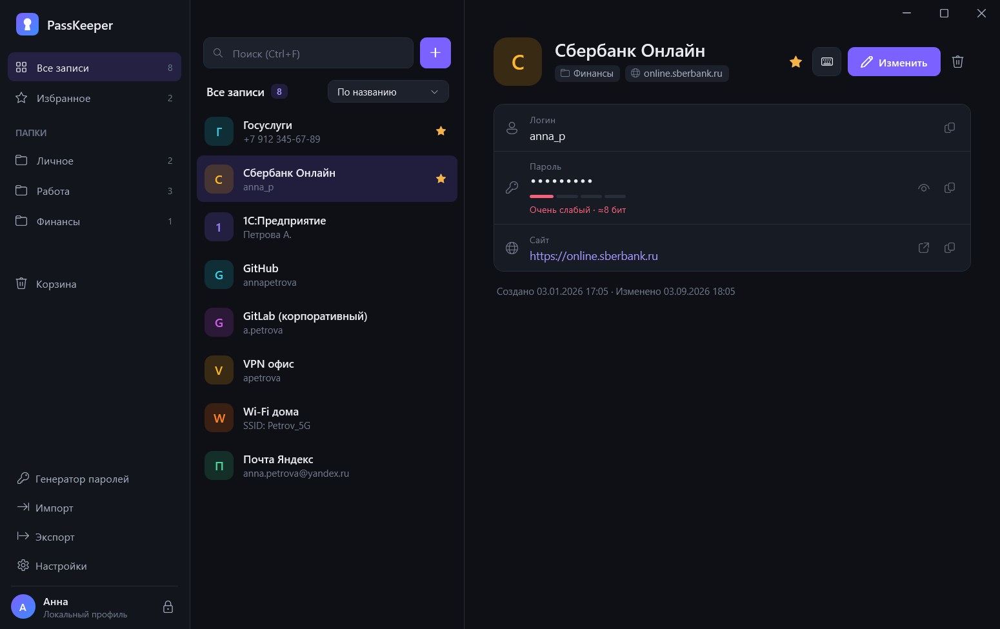
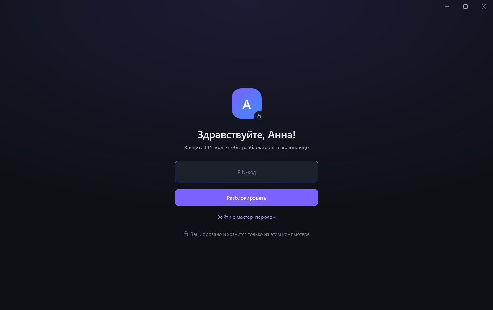
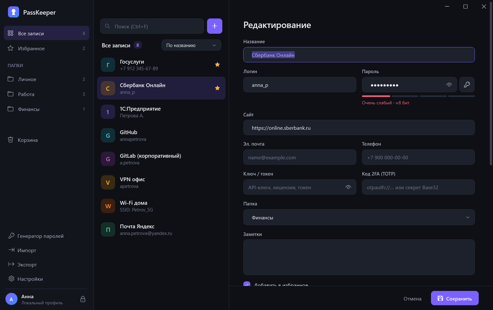
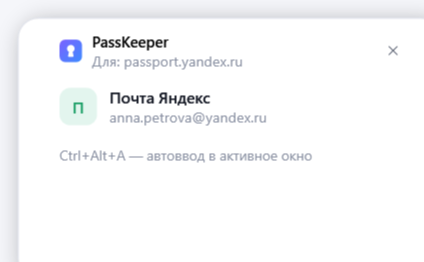

# PassKeeper

Offline password manager for Windows. No network access, no cloud, no telemetry. Per-user installation without administrator rights or machine-wide installation for all users.

[English](#english) · [Русский](#русский)



| | |
|---|---|
|  |  |
|  |  |

---

## English

### Specifications

| Parameter | Value |
|---|---|
| OS | Windows 10 (1903+), Windows 11, x64 |
| Runtime | self-contained .NET 10; installer runs on the built-in .NET Framework 4.8 |
| Network | none |
| Package size | installer 67 MB, installed 160 MB |
| Vault encryption | AES-256-GCM, random 256-bit vault key |
| Key derivation | Argon2id, 64 MiB, 3 iterations, 4 lanes, 256-bit salt |
| Integrity | file header authenticated as AAD; any modification is detected |
| Quick unlock | PIN 4–12 digits, Argon2id + Windows DPAPI binding, 5 attempts, then master password |
| Auto-lock | after 8 h of inactivity (5 min – 24 h), optionally on Windows lock |
| Clipboard | cleared after 30 s (10–60 s / never), excluded from clipboard history and cloud sync |
| Backups | previous version + daily copies for 14 days (encrypted) |
| Autofill | UI Automation / MSAA field detection, SendInput typing; verified in Chrome 153 and Firefox 156 |
| Auto-type hotkey | Ctrl+Alt+A (configurable) |
| Import | 25+ sources, see below |
| Export | 13 formats |
| UI languages | English, Russian |
| Tests | 70 unit tests |

### Features

- Entry fields: title, login, password, URLs, e-mail, phone, key/token, TOTP, notes, folders, favorites, custom (hidden) fields, password history, trash.
- First run: local profile with master password, then mandatory PIN. Later starts and inactivity locks ask for the PIN only.
- Autofill: a suggestion appears next to a focused login, password, e-mail, phone, one-time code or key field in any browser or desktop application. Hotkey auto-type matches the active site or window (title / process name, wildcards). Sequences: `{USERNAME}{TAB}{PASSWORD}{ENTER}`, `{EMAIL}`, `{PHONE}`, `{KEY}`, `{TOTP}`, `{DELAY n}`, `{S:field}`.
- Password generator, strength estimate, weak/reused password overview.
- Tray, autostart (no administrator rights), dark/light/system theme.

### Import / export

| Import | |
|---|---|
| Browsers (direct) | Chrome, Edge, Yandex Browser, Opera, Opera GX, Brave, Vivaldi, Chromium, Atom, Firefox, Waterfox, LibreWolf, Floorp, Zen, Thunderbird |
| Password managers | KeePass/KeePassXC (KDBX 3.1/4 with password and key file, XML, CSV), Bitwarden (JSON, CSV), 1Password (1PUX, CSV), LastPass, Dashlane, NordPass, Proton Pass, RoboForm, Keeper, Kaspersky Password Manager |
| Other | Windows Credential Manager, any CSV (UTF-8/UTF-16/Windows-1251, `,` `;` Tab), PassKeeper PKX/JSON |

Export: PassKeeper PKX (encrypted), KeePass KDBX 4 (encrypted), CSV for Chromium browsers, Firefox, Bitwarden, 1Password, LastPass, KeePassXC, full CSV, full JSON, Bitwarden JSON, KeePass XML, HTML. Every export requires the master password.

Chrome 127+ protects newly saved passwords with App-Bound Encryption, which third-party applications cannot read. Such entries are listed in the import report; export them from Chrome (Settings → Password Manager → Export) and import the CSV.

### Installation

```bat
PassKeeper-Setup-1.0.0.exe
```

| Mode | Location | Rights |
|---|---|---|
| Just me | `%LOCALAPPDATA%\Programs\PassKeeper` | user |
| All users | `%ProgramFiles%\PassKeeper` | administrator |
| Portable (zip) | any folder, data in `.\Data` | user |

Silent install: `/S`, `/allusers` or `/currentuser`, `/desktop`, `/autostart` or `/noautostart`, `/nolaunch`, `"/dir=path"`, `/lang=en|ru`. Exit codes: 0 ok, 1 error, 740 elevation required, 1602 cancelled.

```bat
PassKeeper-Setup-1.0.0.exe /S /allusers /desktop /autostart
```

Uninstall: Settings → Apps, or `PassKeeper.exe --uninstall [--quiet]`. User vaults are kept unless removal is selected.

Data: `%APPDATA%\PassKeeper` — `vault.pkv`, `pin.dat` (DPAPI), `settings.json`, `Backups\`. Override with `--data <dir>`.

### Build

Requires .NET 10 SDK.

```powershell
powershell -ExecutionPolicy Bypass -File .\build.ps1
```

Output in `dist\`: installer, portable zip, `SHA256SUMS.txt`. Tests: `dotnet test tests/PassKeeper.Tests`.

| Path | Contents |
|---|---|
| `src/PassKeeper.Core` | cryptography, vault, PIN, import/export, KDBX, TOTP, matching |
| `src/PassKeeper` | WPF application |
| `src/PassKeeper.Setup` | installer (.NET Framework 4.8) |
| `tests/PassKeeper.Tests` | unit tests |

### Limitations

- Windows blocks simulated input into applications running as administrator unless PassKeeper runs elevated too.
- Binaries are not code-signed.
- The master password cannot be recovered.

---

## Русский

### Характеристики

| Параметр | Значение |
|---|---|
| ОС | Windows 10 (1903+), Windows 11, x64 |
| Среда выполнения | встроенная .NET 10; установщик работает на штатном .NET Framework 4.8 |
| Сеть | не используется |
| Размер | установщик 67 МБ, после установки 160 МБ |
| Шифрование хранилища | AES-256-GCM, случайный 256-битный ключ |
| Формирование ключа | Argon2id, 64 МиБ, 3 прохода, 4 потока, соль 256 бит |
| Целостность | заголовок файла аутентифицируется (AAD), любое изменение обнаруживается |
| Быстрый вход | PIN 4–12 цифр, Argon2id + привязка к учётной записи Windows (DPAPI), 5 попыток, затем мастер-пароль |
| Автоблокировка | через 8 ч бездействия (5 мин – 24 ч), опционально при блокировке Windows |
| Буфер обмена | очистка через 30 с (10–60 с / никогда), исключение из журнала и облачной синхронизации |
| Резервные копии | предыдущая версия + ежедневные копии за 14 дней (зашифрованы) |
| Автозаполнение | поиск полей через UI Automation / MSAA, ввод через SendInput; проверено в Chrome 153 и Firefox 156 |
| Горячая клавиша автоввода | Ctrl+Alt+A (настраивается) |
| Импорт | 25+ источников, см. ниже |
| Экспорт | 13 форматов |
| Языки интерфейса | русский, английский |
| Тесты | 70 модульных тестов |

### Возможности

- Поля записи: название, логин, пароль, адреса сайтов, e-mail, телефон, ключ/токен, TOTP, заметки, папки, избранное, дополнительные (скрытые) поля, история паролей, корзина.
- Первый запуск: локальный профиль с мастер-паролем, затем обязательный PIN. При следующих запусках и после автоблокировки запрашивается только PIN.
- Автозаполнение: подсказка появляется рядом с полем логина, пароля, e-mail, телефона, одноразового кода или ключа в любом браузере и программе. Автоввод по горячей клавише подбирает запись по сайту или окну (заголовок / имя процесса, маски `*`). Последовательности: `{USERNAME}{TAB}{PASSWORD}{ENTER}`, `{EMAIL}`, `{PHONE}`, `{KEY}`, `{TOTP}`, `{DELAY n}`, `{S:поле}`.
- Генератор паролей, оценка стойкости, обзор слабых и повторяющихся паролей.
- Трей, автозапуск (без прав администратора), тёмная/светлая/системная тема.

### Импорт и экспорт

| Импорт | |
|---|---|
| Браузеры (напрямую) | Chrome, Edge, Яндекс Браузер, Opera, Opera GX, Brave, Vivaldi, Chromium, Atom, Firefox, Waterfox, LibreWolf, Floorp, Zen, Thunderbird |
| Менеджеры паролей | KeePass/KeePassXC (KDBX 3.1/4 с паролем и файлом-ключом, XML, CSV), Bitwarden (JSON, CSV), 1Password (1PUX, CSV), LastPass, Dashlane, NordPass, Proton Pass, RoboForm, Keeper, Kaspersky Password Manager |
| Прочее | диспетчер учётных данных Windows, любой CSV (UTF-8/UTF-16/Windows-1251, `,` `;` Tab), PassKeeper PKX/JSON |

Экспорт: PassKeeper PKX (зашифрованный), KeePass KDBX 4 (зашифрованный), CSV для Chromium-браузеров, Firefox, Bitwarden, 1Password, LastPass, KeePassXC, полный CSV, полный JSON, Bitwarden JSON, KeePass XML, HTML. Экспорт требует мастер-пароль.

Chrome 127+ шифрует новые пароли App-Bound Encryption, недоступной сторонним программам. Такие записи отмечаются в отчёте импорта: выгрузите их из Chrome (Настройки → Менеджер паролей → Экспорт) и импортируйте CSV.

### Установка

```bat
PassKeeper-Setup-1.0.0.exe
```

| Режим | Папка | Права |
|---|---|---|
| Только для меня | `%LOCALAPPDATA%\Programs\PassKeeper` | пользователь |
| Для всех пользователей | `%ProgramFiles%\PassKeeper` | администратор |
| Портативный (zip) | любая папка, данные в `.\Data` | пользователь |

Тихая установка: `/S`, `/allusers` или `/currentuser`, `/desktop`, `/autostart` или `/noautostart`, `/nolaunch`, `"/dir=путь"`, `/lang=ru|en`. Коды возврата: 0 — успех, 1 — ошибка, 740 — нужны права администратора, 1602 — отменено.

```bat
PassKeeper-Setup-1.0.0.exe /S /allusers /desktop /autostart
```

Удаление: Параметры → Приложения или `PassKeeper.exe --uninstall [--quiet]`. Хранилища пользователей сохраняются, если не выбрано их удаление.

Данные: `%APPDATA%\PassKeeper` — `vault.pkv`, `pin.dat` (DPAPI), `settings.json`, `Backups\`. Другая папка: `--data <папка>`.

### Сборка

Нужен .NET 10 SDK.

```powershell
powershell -ExecutionPolicy Bypass -File .\build.ps1
```

Результат в `dist\`: установщик, портативный zip, `SHA256SUMS.txt`. Тесты: `dotnet test tests/PassKeeper.Tests`.

| Путь | Содержимое |
|---|---|
| `src/PassKeeper.Core` | криптография, хранилище, PIN, импорт/экспорт, KDBX, TOTP, сопоставление |
| `src/PassKeeper` | приложение WPF |
| `src/PassKeeper.Setup` | установщик (.NET Framework 4.8) |
| `tests/PassKeeper.Tests` | модульные тесты |

### Ограничения

- Windows не пропускает эмулированный ввод в программы, запущенные от имени администратора, если PassKeeper запущен без этих прав.
- Исполняемые файлы не подписаны цифровой подписью.
- Мастер-пароль не восстанавливается.
